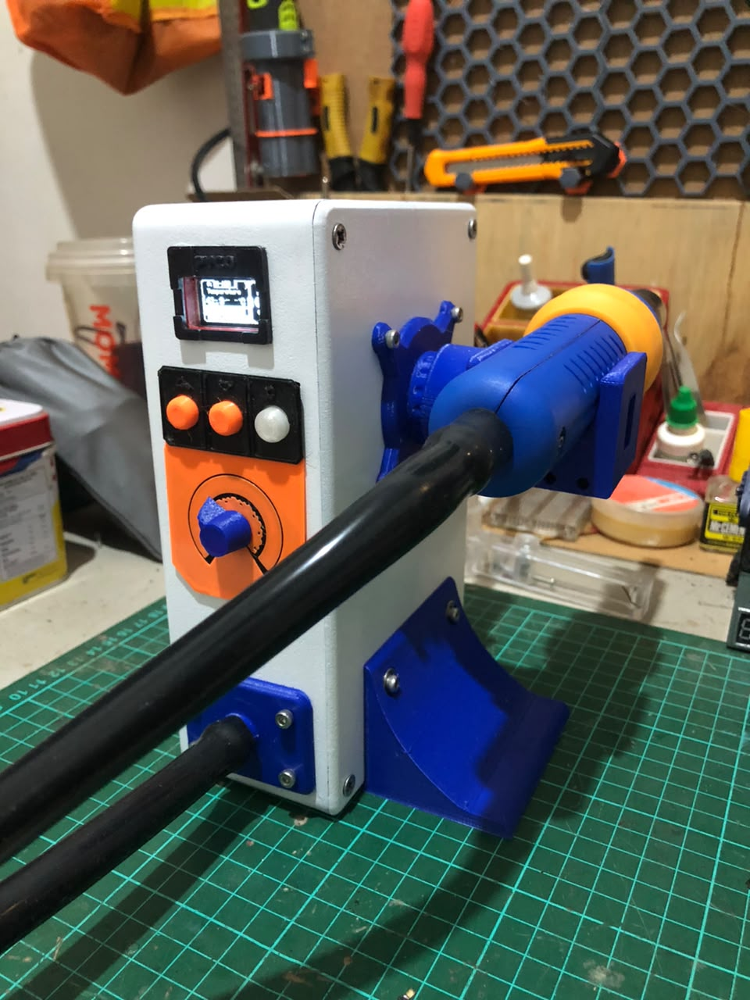
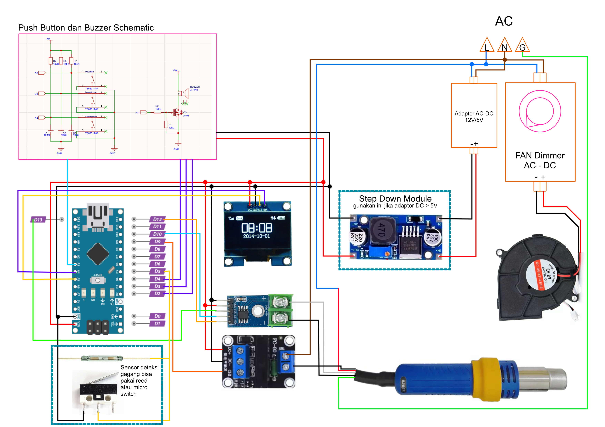

# PYCO — DIY Hot Air Rework Station

Solder uap (hot air rework station) custom berbasis Arduino Nano, dengan kontrol suhu PID, layar OLED custom, dan beberapa lapisan safety yang dikembangkan lewat proses trial-and-error di dunia nyata.



## Fitur

- Kontrol suhu PID dengan anti-windup
- **Setpoint ramping** — target suhu internal dinaikkan pelan-pelan, bukan langsung loncat ke target akhir, supaya lebih toleran terhadap sensor yang punya delay/lag
- **Output ramp limiter** — kenaikan daya heater dibatasi per siklus, gak bisa lompat 0% → 100% langsung
- **Output hard cap** — batas atas daya heater yang bisa diturunkan sebagai jaring pengaman tambahan
- Auto-standby lewat microswitch di cradle/stand — heater otomatis mati saat gagang diletakkan
- Deteksi kegagalan sensor (thermocouple open circuit) dan overtemperature cutoff
- UI custom di OLED SSD1306
- Buzzer pasif untuk feedback startup, tombol, dan alarm
- Setpoint tersimpan otomatis ke EEPROM

## Daftar Komponen

| Komponen                       | Keterangan                                                                      |
| ------------------------------ | ------------------------------------------------------------------------------- |
| Arduino Nano                   | Otak kontrolnya                                                                 |
| OLED SSD1306 128x64 (I2C)      | Layar utama                                                                     |
| MAX6675                        | Interface pembacaan thermocouple K-type                                         |
| SSR (Solid State Relay)        | Kontrol daya AC ke elemen heater (modul aktif-LOW pada pin kontrol)             |
| Blower keong 12V               | Dengan speed control AC bawaan, dikontrol manual (tidak lewat Arduino)          |
| Gagang hot air gun             | Termasuk elemen heater + thermocouple                                           |
| Step-down converter (optional) | Suplai 5V untuk Arduino, MAX6675, dan sisi kontrol SSR (Jika adapter diatas 5V) |
| Adapter 12V / 5V AC-DC         | Sumber daya utama sisi DC                                                       |
| Buzzer pasif                   | Feedback audio                                                                  |
| 3x push button                 | Set suhu (UP / DOWN / SELECT)                                                   |
| Microswitch / limit switch     | Deteksi gagang di cradle/stand                                                  |

## Pin Mapping (Arduino Nano)

| Fungsi              | Pin | Catatan                                                        |
| ------------------- | --- | -------------------------------------------------------------- |
| Tombol UP           | D2  | `INPUT_PULLUP`                                                 |
| Tombol DOWN         | D3  | `INPUT_PULLUP`                                                 |
| Tombol SELECT       | D4  | `INPUT_PULLUP`, belum ada fungsi bisa tanpa ini                |
| Switch cradle/stand | D5  | `INPUT_PULLUP`, aktif LOW saat gagang di stand                 |
| Kontrol SSR         | D9  | **Aktif LOW** pada modul yang dipakai — lihat catatan di bawah |
| MAX6675 CS          | D10 |                                                                |
| MAX6675 SCK         | D13 | Hardware SPI                                                   |
| MAX6675 SO (MISO)   | D12 | Hardware SPI                                                   |
| Buzzer pasif        | A3  | Pakai `tone()`/`noTone()`                                      |
| OLED SDA            | A4  | I2C                                                            |
| OLED SCL            | A5  | I2C                                                            |

> ⚠️ **Polaritas SSR:** banyak modul SSR/relay board dengan pin `DC+/DC-/CH` itu **aktif LOW** di sisi kontrolnya (CH LOW = ON, CH HIGH = OFF) — kebalikan dari asumsi umum. Firmware ini sudah menangani lewat helper `setSSR()` dengan flag `SSR_ACTIVE_LOW`. **Selalu verifikasi polaritas modul SSR kamu sebelum menyambung ke AC mains** — salah asumsi di sini bisa bikin heater menyala terus tanpa terkendali.

## Skematik & Wiring



Atau bisa download PDFnya 

### Catatan wiring gagang

Konfigurasi kabel gagang bervariasi tergantung merek/model. Yang dipakai di project ini (referensi untuk gagang sejenis):

- 2 kabel → elemen heater (AC, langsung ke SSR)
- 2 kabel → thermocouple (ke MAX6675)
- 1 kabel → ground/chassis (opsional, ke ground AC — bukan ke GND DC Arduino)

**Penting:** ukur dulu tiap pasang kabel pakai multimeter sebelum disambung permanen. Warna kabel gagang **tidak standar** antar produsen/varian — jangan asumsikan berdasarkan warna atau referensi dari produk lain.

## Software / Build

Project ini pakai [PlatformIO](https://platformio.org/).

```ini
[env:nanoatmega328]
platform  = atmelavr
board     = nanoatmega328
framework = arduino
monitor_speed = 9600

lib_deps =
    olikraus/U8g2
    adafruit/MAX6675 library
```

> ⚠️ Jika menggunakan ArduinoIDE tinggal copas isi dari file [main.cpp](./src/main.cpp)
> Kalau upload gagal (`avrdude: stk500_recv()` timeout), coba ganti `board` ke `nanoatmega328new` — tergantung varian bootloader Nano kamu.

### Build & upload

```bash
pio run                  # compile
pio run -t upload        # compile + flash ke Nano
pio device monitor        # buka serial monitor (buat debug live: suhu, output PID, dll)
```

## Kalibrasi & Tuning

- **PID gains** (`Kp`, `Ki`, `Kd`) di awal `main.cpp` — titik awal yang dipakai project ini: `Kp=8.0, Ki=0.3, Kd=4.0`. Sesuaikan sesuai karakteristik elemen heater kamu.
- **`SETPOINT_RAMP_RATE`** — kecepatan kenaikan target suhu internal (°C/detik). Naikkan untuk heat-up lebih cepat (risiko overshoot naik), turunkan kalau masih overshoot.
- **`MAX_OUTPUT_STEP`** — batas kenaikan daya heater per siklus PID.
- **`MAX_OUTPUT_CAP`** — batas atas daya heater. Berguna sebagai jaring pengaman sementara selama proses validasi sensor/elemen baru.
- **`TEMP_MAX_SAFETY`** — batas overtemperature hard cutoff.

## Lessons Learned / Known Issues

Dicatat di sini biar berguna buat yang mau bikin project serupa:

- **Modul SSR murah sering aktif-LOW** di sisi kontrolnya — selalu ukur dulu dengan LED indikator modul (kalau ada) sebelum asumsi polaritas.
- **MAX6675 butuh jeda minimal ~250ms antar pembacaan** — kalau dipanggil lebih cepat dari itu di `loop()`, pembacaan bisa "beku" di satu nilai karena chip belum selesai konversi baru.
- **Blower dan heater sebaiknya di-interlock** — kalau blower kurang kuat/tidak menyala saat heater aktif, panas bisa terkumpul lokal di elemen tanpa terdeteksi sensor, berisiko merusak elemen.
- **Uji sensor secara terisolasi dulu** (tanpa sambung kabel heater) sebelum melakukan uji dengan daya penuh — ini menghemat komponen kalau ternyata ada masalah sensor.

[MIT License](LICENSE).
